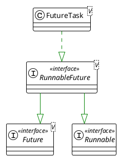

先看看它的继承结构

[[Drawing 2023-12-15 10.24.42.excalidraw]]

```java
public void run() {
	if (state != NEW ||
		!RUNNER.compareAndSet(this, null, Thread.currentThread()))
		return;
	try {
		Callable<V> c = callable;
		if (c != null && state == NEW) {
			V result;
			boolean ran;
			try {
				result = c.call();
				ran = true;
			} catch (Throwable ex) {
				result = null;
				ran = false;
				setException(ex);
			}
			if (ran)
				set(result);
		}
	} finally {
		// runner must be non-null until state is settled to
		// prevent concurrent calls to run()
		runner = null;
		// state must be re-read after nulling runner to prevent
		// leaked interrupts
		int s = state;
		if (s >= INTERRUPTING)
			handlePossibleCancellationInterrupt(s);
	}
}

```