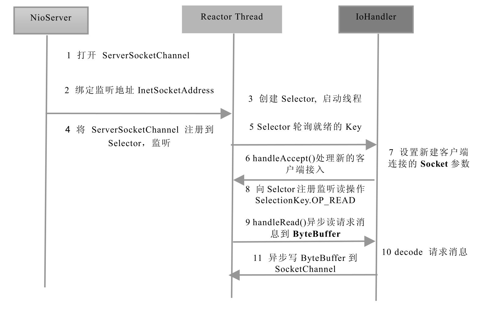

# 简介

官方称为New I/O，原因在于它相对于之前的I/O类库是新增的。但是，更多的人喜欢称之为非阻塞I/O（Non-block I/O）。


1.缓冲区Buffer

Buffer是一个对象，它包含一些要写入或者要读出的数据。

在面向流的I/O中，可以将数据直接写入或者将数据直接读到Stream对象中。
在NIO库中，所有数据都是用缓冲区处理的。在读取数据时，它是直接读到缓冲区中的；在写入数据时，写入到缓冲区中。任何时候访问NIO中的数据，都是通过缓冲区进行操作。

缓冲区实质上是一个数组。通常它是一个字节数组（ByteBuffer），也可以使用其他种类的数组。但是一个缓冲区不仅仅是一个数组，缓冲区提供了对数据的结构化访问以及维护读写位置（limit）等信息。

最常用的缓冲区是ByteBuffer，一个ByteBuffer提供了一组功能用于操作byte数组。除了ByteBuffer，还有其他的一些缓冲区，事实上，每一种Java基本类型（除了Boolean类型）都对应有一种缓冲区，具体如下。


◎ ByteBuffer：字节缓冲区
◎ CharBuffer：字符缓冲区
◎ ShortBuffer：短整型缓冲区
◎ IntBuffer：整形缓冲区
◎ LongBuffer：长整形缓冲区
◎ FloatBuffer：浮点型缓冲区
◎ DoubleBuffer：双精度浮点型缓冲区


2.通道Channel

Channel是一个通道，它就像自来水管一样，网络数据通过Channel读取和写入。通道与流的不同之处在于通道是双向的，流只是在一个方向上移动（一个流必须是InputStream或者OutputStream的子类），而通道可以用于读、写或者二者同时进行。

因为Channel是全双工的，所以它可以比流更好地映射底层操作系统的API。特别是在UNIX网络编程模型中，底层操作系统的通道都是全双工的，同时支持读写操作。

Channel的类图继承关系如图2-9所示。

自顶向下看，前三层主要是Channel接口，用于定义它的功能，后面是一些具体的功能类（抽象类）。

从类图可以看出，实际上Channel可以分为两大类：用于网络读写的SelectableChannel和用于文件操作的FileChannel。

3.多路复用器Selector

多路复用器提供选择已经就绪的任务的能力。简单来讲，Selector会不断地轮询注册在其上的Channel，如果某个Channel上面发生读或者写事件，这个Channel就处于就绪状态，会被Selector轮询出来，然后通过SelectionKey可以获取就绪Channel的集合，进行后续的I/O操作。一个多路复用器Selector可以同时轮询多个Channel，由于JDK使用了epoll()代替传统的select实现，所以它并没有最大连接句柄1024/2048的限制。这也就意味着只需要一个线程负责Selector的轮询，就可以接入成千上万的客户端。


步骤一：打开ServerSocketChannel，用于监听客户端的连接，它是所有客户端连接的父管道
```java
ServerSocketChannel acceptor = ServerSocketChannel.open();
```

步骤二：绑定监听端口，设置连接为非阻塞模式
```java
acceptor.socket().bind(new InetSocketAddress(InetAddress.getByName("ip"), port));
acceptor.configureBlocking(false);
```

步骤三：创建Reactor线程，创建多路复用器并启动线程
```java
Selector selector = Selector.open();
new Thread(new ReactorTask()).start();
```

步骤四：将ServerSocketChannel注册到Reactor线程的多路复用器Selector上，监听ACCEPT事件

```java
SelectionKey key = acceptor.register(selector,SelectionKey.OP_ACCEPT,ioHandler);
```

步骤五：多路复用器在线程run方法的无限循环体内轮询准备就绪的key

步骤六：多路复用器监听到有新的客户端接入，处理新的接入请求，完成TCP三次握手，建立物理链路

步骤七：设置客户端链路为非阻塞模式

步骤八：将新接入的客户端连接注册到Reactor线程的多路复用器上，监听读操作，读取客户端发送的网络消息

步骤九：异步读取客户端请求消息到缓冲区

步骤十：对ByteBuffer进行编解码，如果有半包消息指针reset，继续读取后续的报文，将解码成功的消息封装成Task，投递到业务线程池中，进行业务逻辑编排

步骤十一：将POJO对象encode成ByteBuffer，调用SocketChannel的异步write接口，将消息异步发送给客户端


NIO 全称 Non-Blocking I/O，也有人称之为 New I/O，它是 JDK 1.4 中引入的一种同步非阻塞的 I/O 模型。它弥补了传统 I/O 的不足，是解决大量连接与高并发的有效方式。Java NIO 适用于连接数较多且连接时间较短的场景。

NIO 是基于 Reactor 反应堆模式实现的，简单来说，反应堆模式包含三步：
1. 注册感兴趣的事件；
2. 扫描是否有感兴趣的事件发生；
3. 事件发生后做出相应的处理；

NIO 包含三大核心组件：Channel 通道、Buffer 缓冲区 和 Selector 选择器

Channel 是应用程序和操作系统交互事件、传递数据的通道，通道中的数据总是要先读到一个 Buffer，或者从一个 Buffer 中写入。所有被 Selector 注册的通道，都只能是继承了 SelectableChannel 类的子类。Java NIO 中的 Channel 主要有以下几种类型：
- FileChannel：用于本地文件的读取、写入、映射和操作的通道
- DatagramChannel：可用于实现发送和接收 UDP 协议数据包的通道
- ServerSocketChannel：应用服务程序的监听通道，可视为被 Channel 包装的 ServerSocket;
- SocketChannel：TCP Socket 的监听通道，可视为被 Channel 包装的 Socket;

Buffer 缓冲区，主要用于和 Channel 进行交互。以写为例，应用程序先将数据写入缓冲区，再通过通道把缓冲区的数据发送出去;读也是一样，数据先从通道读到缓冲区，应用程序再读取缓冲区的数据。Buffer 缓冲区本质上是一个字节数组，Buffer 读写数据一般遵循如下步骤：
1. 写数据到 Buffer 缓冲区;
2. 调用 flip() 方法将 Buffer 从写模式切换到读模式;
3. 从 Buffer 中读取数据;
4. 调用 clear()方法或者 compact()方法清理数据，准备下一次的写入;
常见的 Buffer 实现有：ByteBuffer，CharBuffe，DoubleBuffer，FloatBuffer，IntBuffer，LongBuffer，ShortBuffer；此外还有 MappedByteBuffer，HeapByteBuffer，DirectByteBuffer 等。

Selector 一般被称为选择器或者多路复用器，要实现 Selector 管理 Channel，首先需要将 Channel 及其关注的事件注册在 Selector 上，Selector 会不断轮询出就绪状态的 Channel 关注的事件集合，进而做相应的业务处理。通常情况下，一个线程会开启一个 Selector，而一个 Selector 可以管理多个 Channel，也就是说，一个线程就可以管理多个网络连接，即所谓的多路复用。

NIO 三大核心组件的关系如下图：

# SelectionKey的类型和就绪条件
在向 Selector 对象注册感兴趣的事件时，JAVA NIO 在抽象类 SelectionKey 中共定义了四种事件类型：OP_READ、OP_WRITE、OP CONNECT、OP_ACCEPT，分别对应 I/O 读写、请求连接 和 接受连接操作。

| 操作类型       | 就绪条件及说明                                                                                                                     |
| ---------- | --------------------------------------------------------------------------------------------------------------------------- |
| OP_READ    | 当操作系统读缓冲区有数据可读时就绪。一般需要注册该事件。                                                                                                |
| OP_WRITE   | 当操作系统写缓冲区有空闲空间时就绪。一般情况下写缓冲区都有空闲空间，小块数据直接写入即可没必要注册该操作类型，否则该条件不断就绪浪费CPU；但如果是写密集型的任务，注册该操作类型就很有必要，比如文件下载等，缓冲区很可能满，同时注意写完后取消注册。 |
| OP_CONNECT | 当SocketChannel.connct()请求连接成功后就绪。该操作只给客户端使用。                                                                                |
| OP_ACCEPT  | 当接收到一个客户端连接请求时就绪。该操作只给服务器使用。                                                                                                |

# 客户端和服务端关注的事件类型
|                         | OP_READ | OP_WRITE | OP_CONNECT | OP_ACCEPT |
| ----------------------- | ------- | -------- | ---------- | --------- |
| 服务器 ServerSocketChannel |         |          |            | Y         |
| 服务器 SocketChannel       | Y       | Y        |            |           |
| 客户端 SocketChannel       | Y       | Y        | Y          |           |
# 直接缓冲和非直接缓冲
HeapByteBuffer 堆缓冲，也叫非直接缓冲。它通过 allocate()方法在 JVM 堆内存中分配的缓冲，真正 flush 到远程的时候会先拷贝到直接内存，再做下一步操作。

而 DirectByteBuffer 则是通过 allocateDirect() 方法在直接内存中分配，这样可以减少一次复制过程，提高 I/O 读取的效率。虽然直接缓冲可以进行高效的 I/O 操作，但它使用的内存是操作系统分配的，绕过了JVM堆栈：建立和销毁比堆栈上的缓冲区要更大的开销

# 说一下Selector的select()方法
我们通过 Selector 的 select()方法选择已经准备就绪的通道，它有以下几个重载方法：
- select()：该方法会一直阻塞到至少有一个通道在你注册的事件上就绪；
- select(long timeout)：和select()一样，但最长阻塞事件为 timeout 毫秒。
- selectNow()：非阻塞，立刻返回。
