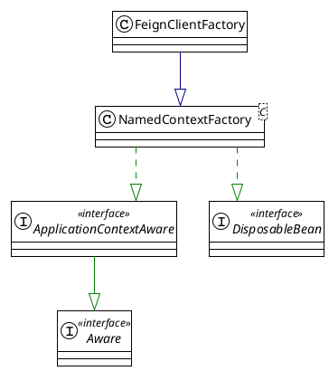

![[OpenFeign的执行流程 2023-12-29 08.50.00.excalidraw|1000]]
使用OpenFeign需要加`@EnableFeignClients`注解，如下代码，`@EnableFeignClients`注解上加了`@Import(FeignClientsRegistrar.class)`
```java
@Import(FeignClientsRegistrar.class)
public @interface EnableFeignClients {
```
FeignClientsRegistrar是ImportBeanDefinitionRegistrar的实现类，直接看一下registerBeanDefinitions方法
```java
public void registerBeanDefinitions(AnnotationMetadata metadata, BeanDefinitionRegistry registry) {
	// 使用EnableFeignClients#defaultConfiguration元数据注册FeignClientSpecification.class到spring容器
	registerDefaultConfiguration(metadata, registry);
	// 遍历FeignClient注解的rpc接口，为每个rpc注册一个FeignClientFactoryBean到spring容器
	// 为每个FeignClient注解的rpc接口，注册一个对应FeignClient#configuration信息的FeignClientSpecification.class到spring容器
	registerFeignClients(metadata, registry);
}

```
注入默认FeignClientSpecification到spring容器，从名字可以看出来是一个FeignCilent默认配置类，信息来自于 `@EnableFeiginClient` 的注解信息
```java
private void registerDefaultConfiguration(AnnotationMetadata metadata, BeanDefinitionRegistry registry) {
	Map<String, Object> defaultAttrs = metadata.getAnnotationAttributes(EnableFeignClients.class.getName(), true);

	if (defaultAttrs != null && defaultAttrs.containsKey("defaultConfiguration")) {
		String name;
		if (metadata.hasEnclosingClass()) {
			name = "default." + metadata.getEnclosingClassName();
		}
		else {
			name = "default." + metadata.getClassName();
		}
		registerClientConfiguration(registry, name, "default", defaultAttrs.get("defaultConfiguration"));
	}
}
private void registerClientConfiguration(BeanDefinitionRegistry registry, Object name, Object className,
		Object configuration) {
	BeanDefinitionBuilder builder = BeanDefinitionBuilder.genericBeanDefinition(FeignClientSpecification.class);
	builder.addConstructorArgValue(name);
	builder.addConstructorArgValue(className);
	builder.addConstructorArgValue(configuration);
	registry.registerBeanDefinition(name + "." + FeignClientSpecification.class.getSimpleName(),
			builder.getBeanDefinition());
}

```
循环遍历 `@FeignClient` 注解的所有bean，并把FeignClientFactoryBean注入到spring容器中
```java
public void registerFeignClients(AnnotationMetadata metadata, BeanDefinitionRegistry registry) {
	LinkedHashSet<BeanDefinition> candidateComponents = new LinkedHashSet<>();
	Map<String, Object> attrs = metadata.getAnnotationAttributes(EnableFeignClients.class.getName());
	final Class<?>[] clients = attrs == null ? null : (Class<?>[]) attrs.get("clients");
	if (clients == null || clients.length == 0) {
		ClassPathScanningCandidateComponentProvider scanner = getScanner();
		scanner.setResourceLoader(this.resourceLoader);
		// 设置FeignClient.class为查询条件
		scanner.addIncludeFilter(new AnnotationTypeFilter(FeignClient.class));
		Set<String> basePackages = getBasePackages(metadata);
		for (String basePackage : basePackages) {
// 查找出所有的FeignClient注解的类
			candidateComponents.addAll(scanner.findCandidateComponents(basePackage));
		}
	}
	else {
		for (Class<?> clazz : clients) {
			candidateComponents.add(new AnnotatedGenericBeanDefinition(clazz));
		}
	}

	for (BeanDefinition candidateComponent : candidateComponents) {
		if (candidateComponent instanceof AnnotatedBeanDefinition beanDefinition) {
			// verify annotated class is an interface
			AnnotationMetadata annotationMetadata = beanDefinition.getMetadata();
			Assert.isTrue(annotationMetadata.isInterface(), "@FeignClient can only be specified on an interface");

			Map<String, Object> attributes = annotationMetadata
					.getAnnotationAttributes(FeignClient.class.getCanonicalName());

			// 这里是client名称
			String name = getClientName(attributes);
			String className = annotationMetadata.getClassName();
			// 为每个FeignClient注解的类注册一个配置bean到spring容器
			registerClientConfiguration(registry, name, className, attributes.get("configuration"));

			registerFeignClient(registry, annotationMetadata, attributes);
		}
	}
}

```

```java
private void registerFeignClient(BeanDefinitionRegistry registry, AnnotationMetadata annotationMetadata,
		Map<String, Object> attributes) {
	String className = annotationMetadata.getClassName();
	if (String.valueOf(false).equals(
			environment.getProperty("spring.cloud.openfeign.lazy-attributes-resolution", String.valueOf(false)))) {
		eagerlyRegisterFeignClientBeanDefinition(className, attributes, registry);
	}
	else {
		lazilyRegisterFeignClientBeanDefinition(className, attributes, registry);
	}
}

	private void eagerlyRegisterFeignClientBeanDefinition(String className, Map<String, Object> attributes,
			BeanDefinitionRegistry registry) {
		validate(attributes);
		BeanDefinitionBuilder definition = BeanDefinitionBuilder.genericBeanDefinition(FeignClientFactoryBean.class);
		definition.addPropertyValue("url", getUrl(null, attributes));
		definition.addPropertyValue("path", getPath(null, attributes));
		String name = getName(attributes);
		definition.addPropertyValue("name", name);
		String contextId = getContextId(null, attributes);
		definition.addPropertyValue("contextId", contextId);
		definition.addPropertyValue("type", className);
		definition.addPropertyValue("dismiss404", Boolean.parseBoolean(String.valueOf(attributes.get("dismiss404"))));
		Object fallback = attributes.get("fallback");
		if (fallback != null) {
			definition.addPropertyValue("fallback",
					(fallback instanceof Class ? fallback : ClassUtils.resolveClassName(fallback.toString(), null)));
		}
		Object fallbackFactory = attributes.get("fallbackFactory");
		if (fallbackFactory != null) {
			definition.addPropertyValue("fallbackFactory", fallbackFactory instanceof Class ? fallbackFactory
					: ClassUtils.resolveClassName(fallbackFactory.toString(), null));
		}
		definition.addPropertyValue("fallbackFactory", attributes.get("fallbackFactory"));
		definition.setAutowireMode(AbstractBeanDefinition.AUTOWIRE_BY_TYPE);
		definition.addPropertyValue("refreshableClient", isClientRefreshEnabled());
		String[] qualifiers = getQualifiers(attributes);
		if (ObjectUtils.isEmpty(qualifiers)) {
			qualifiers = new String[] { contextId + "FeignClient" };
		}
		// This is done so that there's a way to retrieve qualifiers while generating AOT
		// code
		definition.addPropertyValue("qualifiers", qualifiers);
		AbstractBeanDefinition beanDefinition = definition.getBeanDefinition();
		Class<?> type = ClassUtils.resolveClassName(className, null);
		beanDefinition.setAttribute(FactoryBean.OBJECT_TYPE_ATTRIBUTE, type);
		// has a default, won't be null
		boolean primary = (Boolean) attributes.get("primary");
		beanDefinition.setPrimary(primary);
		BeanDefinitionHolder holder = new BeanDefinitionHolder(beanDefinition, className, qualifiers);
		BeanDefinitionReaderUtils.registerBeanDefinition(holder, registry);
		registerRefreshableBeanDefinition(registry, contextId, Request.Options.class, OptionsFactoryBean.class);
		registerRefreshableBeanDefinition(registry, contextId, RefreshableUrl.class, RefreshableUrlFactoryBean.class);
	}


```

`FeignClientFactoryBean` 是 `FactoryBean` 的子类，所以我们要看看下 `getObject` 方法怎么生成对象。
```java
	@Override
	public Object getObject() {
		return getTarget();
	}

	/**
	 * @param <T> the target type of the Feign client
	 * @return a {@link Feign} client created with the specified data and the context
	 * information
	 */
	@SuppressWarnings("unchecked")
	<T> T getTarget() {
		// 这个bean是通过FeignAutoConfiguration自动注入地
		FeignClientFactory feignClientFactory = beanFactory != null ? beanFactory.getBean(FeignClientFactory.class)
				: applicationContext.getBean(FeignClientFactory.class);
		// 获取feign的builder，里面设置了从yml读取配置
		// 这里会为每个FeignClient生成私有的spring容器
		Feign.Builder builder = feign(feignClientFactory);
		// 正常应该不配置url的
		if (!StringUtils.hasText(url) && !isUrlAvailableInConfig(contextId)) {

			if (LOG.isInfoEnabled()) {
				LOG.info("For '" + name + "' URL not provided. Will try picking an instance via load-balancing.");
			}
			// 默认添加http协议
			if (!name.startsWith("http://") && !name.startsWith("https://")) {
				url = "http://" + name;
			}
			else {
				url = name;
			}
			// 清除path的前后缀/
			url += cleanPath();
			return (T) loadBalance(builder, feignClientFactory, new HardCodedTarget<>(type, name, url));
		}
		if (StringUtils.hasText(url) && !url.startsWith("http://") && !url.startsWith("https://")) {
			url = "http://" + url;
		}
		Client client = getOptional(feignClientFactory, Client.class);
		if (client != null) {
			if (client instanceof FeignBlockingLoadBalancerClient) {
				// not load balancing because we have a url,
				// but Spring Cloud LoadBalancer is on the classpath, so unwrap
				client = ((FeignBlockingLoadBalancerClient) client).getDelegate();
			}
			if (client instanceof RetryableFeignBlockingLoadBalancerClient) {
				// not load balancing because we have a url,
				// but Spring Cloud LoadBalancer is on the classpath, so unwrap
				client = ((RetryableFeignBlockingLoadBalancerClient) client).getDelegate();
			}
			builder.client(client);
		}

		// 可以自定义FeignBuilderCustomizer对builder自定义
		applyBuildCustomizers(feignClientFactory, builder);

		Targeter targeter = get(feignClientFactory, Targeter.class);
		return targeter.target(this, builder, feignClientFactory, resolveTarget(feignClientFactory, contextId, url));
	}

```

```java
	protected <T> T loadBalance(Feign.Builder builder, FeignClientFactory context, HardCodedTarget<T> target) {
		// 如果没有自己注入feignClient，是从FeignLoadBalancerAutoConfiguration获取,顺序如下OkHttpClient->HttpClient5->http2Client->FeignBlockingLoadBalancerClient（啥都没有使用就是最后一个，feign自带的）
		Client client = getOptional(context, Client.class);
		if (client != null) {
			builder.client(client);
			applyBuildCustomizers(context, builder);
			// 没有配置也是FeignAutoConfiguration注入的
			Targeter targeter = get(context, Targeter.class);
			// targer默认类只是掉了builder.target方法
			return targeter.target(this, builder, context, target);
		}

		throw new IllegalStateException(
				"No Feign Client for loadBalancing defined. Did you forget to include spring-cloud-starter-loadbalancer?");
	}

```

最终返回的是一个JDK代理的类，这里我们就得到了FeignClient注解的RPC接口
```java
  public <T> T newInstance(Target<T> target, C requestContext) {
    TargetSpecificationVerifier.verify(target);

	// 获取每个@RequestMapping注解的方法
    Map<Method, MethodHandler> methodToHandler =
        targetToHandlersByName.apply(target, requestContext);
    InvocationHandler handler = factory.create(target, methodToHandler);
    T proxy = (T) Proxy.newProxyInstance(target.type().getClassLoader(),
        new Class<?>[] {target.type()}, handler);
	// 为rpc方法添加代理方法
    for (MethodHandler methodHandler : methodToHandler.values()) {
      if (methodHandler instanceof DefaultMethodHandler) {
        ((DefaultMethodHandler) methodHandler).bindTo(proxy);
      }
    }

    return proxy;
  }
```

# FeignClient是如何调用provider的呢
需要看下代理类的InvocationHandler
```java
    InvocationHandler handler = factory.create(target, methodToHandler);

    public InvocationHandler create(Target target, Map<Method, MethodHandler> dispatch) {
      return new ReflectiveFeign.FeignInvocationHandler(target, dispatch);
    }

    FeignInvocationHandler(Target target, Map<Method, MethodHandler> dispatch) {
      this.target = checkNotNull(target, "target");
      this.dispatch = checkNotNull(dispatch, "dispatch for %s", target);
    }
    @Override
    public Object invoke(Object proxy, Method method, Object[] args) throws Throwable {
      if ("equals".equals(method.getName())) {
        try {
          Object otherHandler =
              args.length > 0 && args[0] != null ? Proxy.getInvocationHandler(args[0]) : null;
          return equals(otherHandler);
        } catch (IllegalArgumentException e) {
          return false;
        }
      } else if ("hashCode".equals(method.getName())) {
        return hashCode();
      } else if ("toString".equals(method.getName())) {
        return toString();
      } else if (!dispatch.containsKey(method)) {
        throw new UnsupportedOperationException(
            String.format("Method \"%s\" should not be called", method.getName()));
      }

		// 通过当前method获取methodHandler
      return dispatch.get(method).invoke(args);
    }


```


```java
  @Override
  public Object invoke(Object[] argv) throws Throwable {
	// 获取请求模版
    RequestTemplate template = buildTemplateFromArgs.create(argv);
    Options options = findOptions(argv);
    Retryer retryer = this.retryer.clone();
    while (true) {
      try {
        return executeAndDecode(template, options);
      } catch (RetryableException e) {
        try {
          retryer.continueOrPropagate(e);
        } catch (RetryableException th) {
          Throwable cause = th.getCause();
          if (propagationPolicy == UNWRAP && cause != null) {
            throw cause;
          } else {
            throw th;
          }
        }
        if (logLevel != Logger.Level.NONE) {
          logger.logRetry(metadata.configKey(), logLevel);
        }
        continue;
      }
    }
  }

  Object executeAndDecode(RequestTemplate template, Options options) throws Throwable {
	// 使用请求模版获取request
    Request request = targetRequest(template);

    if (logLevel != Logger.Level.NONE) {
      logger.logRequest(metadata.configKey(), logLevel, request);
    }

    Response response;
    long start = System.nanoTime();
    try {
		// 发起请求
      response = client.execute(request, options);
      // ensure the request is set. TODO: remove in Feign 12
      response = response.toBuilder()
          .request(request)
          .requestTemplate(template)
          .build();
    } catch (IOException e) {
      if (logLevel != Logger.Level.NONE) {
        logger.logIOException(metadata.configKey(), logLevel, e, elapsedTime(start));
      }
      throw errorExecuting(request, e);
    }

    long elapsedTime = TimeUnit.NANOSECONDS.toMillis(System.nanoTime() - start);
    return responseHandler.handleResponse(
        metadata.configKey(), response, metadata.returnType(), elapsedTime);
  }

```

```java
	@Override
	public Response execute(Request request, Request.Options options) throws IOException {
		final URI originalUri = URI.create(request.url());
		String serviceId = originalUri.getHost();
		Assert.state(serviceId != null, "Request URI does not contain a valid hostname: " + originalUri);
		String hint = getHint(serviceId);
		DefaultRequest<RequestDataContext> lbRequest = new DefaultRequest<>(
				new RequestDataContext(buildRequestData(request), hint));
		Set<LoadBalancerLifecycle> supportedLifecycleProcessors = LoadBalancerLifecycleValidator
				.getSupportedLifecycleProcessors(
						loadBalancerClientFactory.getInstances(serviceId, LoadBalancerLifecycle.class),
						RequestDataContext.class, ResponseData.class, ServiceInstance.class);
		supportedLifecycleProcessors.forEach(lifecycle -> lifecycle.onStart(lbRequest));
		ServiceInstance instance = loadBalancerClient.choose(serviceId, lbRequest);
		org.springframework.cloud.client.loadbalancer.Response<ServiceInstance> lbResponse = new DefaultResponse(
				instance);
		if (instance == null) {
			String message = "Load balancer does not contain an instance for the service " + serviceId;
			if (LOG.isWarnEnabled()) {
				LOG.warn(message);
			}
			supportedLifecycleProcessors.forEach(lifecycle -> lifecycle
					.onComplete(new CompletionContext<ResponseData, ServiceInstance, RequestDataContext>(
							CompletionContext.Status.DISCARD, lbRequest, lbResponse)));
			return Response.builder().request(request).status(HttpStatus.SERVICE_UNAVAILABLE.value())
					.body(message, StandardCharsets.UTF_8).build();
		}
		String reconstructedUrl = loadBalancerClient.reconstructURI(instance, originalUri).toString();
		Request newRequest = buildRequest(request, reconstructedUrl, instance);
		return executeWithLoadBalancerLifecycleProcessing(delegate, options, newRequest, lbRequest, lbResponse,
				supportedLifecycleProcessors);
	}

```

FeignClientFactory是starter自动配置进来的
```java
@Configuration(proxyBeanMethods = false)
@ConditionalOnClass(Feign.class)
@EnableConfigurationProperties({ FeignClientProperties.class, FeignHttpClientProperties.class,
		FeignEncoderProperties.class })
public class FeignAutoConfiguration {
	@Autowired(required = false)
	private List<FeignClientSpecification> configurations = new ArrayList<>();

	@Bean
	public FeignClientFactory feignContext() {
		FeignClientFactory context = new FeignClientFactory();
		context.setConfigurations(this.configurations);
		return context;
	}

```
FeignClientFactory是NamedContextFactory的子类

> [!NOTE] 拓展一下gpt来的
>  对于`List<FeignClientSpecification> configurations`字段，它是一个列表类型的依赖项，用于存储`FeignClientSpecification`类型的对象。当Spring容器进行自动装配时，它会查找所有匹配`FeignClientSpecification`类型的Bean，并将它们注入到`configurations`字段中的列表中。

```yml
spring:
  cloud:
    openfeign:
      client:
        default-config:
        config:
          my-service:
            #  配置Feign客户端的错误解码器：
            errorDecoder: com.example.MyErrorDecoder
            #  配置Feign客户端的请求拦截器：
            requestInterceptors:
              - com.example.MyRequestInterceptor
            #  启用Feign客户端的重试机制，并配置最大重试次数和重试间隔：
            retryer: com.example.MyRetryer
            maxAttempts: 3
            retryInterval: 1000
            #    设置Feign客户端的连接超时和读取超时时间：
            connectTimeout: 5000
            readTimeout: 5000

```

# Feign.Builder的生成
跟踪一下`feign(feignClientFactory);`方法，看下Feign.Builder怎么生成的
```java
	protected Feign.Builder feign(FeignClientFactory context) {
		FeignLoggerFactory loggerFactory = get(context, FeignLoggerFactory.class);
		Logger logger = loggerFactory.create(type);

		// @formatter:off
		Feign.Builder builder = get(context, Feign.Builder.class)
				// required values
				.logger(logger)
				.encoder(get(context, Encoder.class))
				.decoder(get(context, Decoder.class))
				.contract(get(context, Contract.class));
		// @formatter:on

		configureFeign(context, builder);

		return builder;
	}

```
这里跳过
```java
	protected <T> T get(FeignClientFactory context, Class<T> type) {
		T instance = context.getInstance(contextId, type);
		if (instance == null) {
			throw new IllegalStateException("No bean found of type " + type + " for " + contextId);
		}
		return instance;
	}

```
这里看到返回了一个 spring 容器 AnnotationConfigApplicationContext
```java
// org.springframework.cloud.context.named.NamedContextFactory
	public <T> T getInstance(String name, Class<T> type) {
		GenericApplicationContext context = getContext(name);
		try {
			return context.getBean(type);
		}
		catch (NoSuchBeanDefinitionException e) {
			// ignore
		}
		return null;
	}

	protected GenericApplicationContext getContext(String name) {
		if (!this.contexts.containsKey(name)) {
			synchronized (this.contexts) {
				if (!this.contexts.containsKey(name)) {
					this.contexts.put(name, createContext(name));
				}
			}
		}
		return this.contexts.get(name);
	}

	public GenericApplicationContext createContext(String name) {
		GenericApplicationContext context = buildContext(name);
		// there's an AOT initializer for this context
		if (applicationContextInitializers.get(name) != null) {
			applicationContextInitializers.get(name).initialize(context);
			context.refresh();
			return context;
		}
		registerBeans(name, context);
		context.refresh();
		return context;
	}

	public GenericApplicationContext buildContext(String name) {
		// https://github.com/spring-cloud/spring-cloud-netflix/issues/3101
		// https://github.com/spring-cloud/spring-cloud-openfeign/issues/475
		ClassLoader classLoader = getClass().getClassLoader();
		GenericApplicationContext context;
		// 实现了ApplicationContextAware，所以这里不为null
		if (this.parent != null) {
			DefaultListableBeanFactory beanFactory = new DefaultListableBeanFactory();
			if (parent instanceof ConfigurableApplicationContext) {
				beanFactory.setBeanClassLoader(
						((ConfigurableApplicationContext) parent).getBeanFactory().getBeanClassLoader());
			}
			else {
				beanFactory.setBeanClassLoader(classLoader);
			}
			context = AotDetector.useGeneratedArtifacts() ? new GenericApplicationContext(beanFactory)
					// 走到了这里
					: new AnnotationConfigApplicationContext(beanFactory);
		}
		else {
			context = AotDetector.useGeneratedArtifacts() ? new GenericApplicationContext()
					: new AnnotationConfigApplicationContext();
		}
		context.setClassLoader(classLoader);
		context.getEnvironment().getPropertySources().addFirst(
				new MapPropertySource(this.propertySourceName, Collections.singletonMap(this.propertyName, name)));
		if (this.parent != null) {
			// Uses Environment from parent as well as beans
			context.setParent(this.parent);
		}
		context.setDisplayName(generateDisplayName(name));
		return context;
	}
```


 在我们使用OpenFeign作为远程调用客户端的时候 它的整体执行流程如下 一通过启动类上的at enable finch client注解 开启Feign的装配和远程代理实力的创建 在at enable分几class注解源码中 可以看到它导入一个分解clients register类 该类的作用用于扫描at分解client注解过的rpc接口 通过对at分几client注解rpc接口扫描 创建远程调用的动态代理实例 分解clients register类会进行包扫描 扫描所有包下面的at分几client注解过的接口 创建rpc接口的factory bean工厂类实例 并将这些factory并注入到spring ioc容器中 如果应用的某些地方需要注入rpc接口的实例 比如被艾特瑞士引用 spring就会通过注册的factory bean 工厂实验的get不介意的方法获取rpc接口的动态代理实验 在创建rpc接口动态代理实例时 分解会为每一个rpc接口创建一个调用处理器 也会为每个接口的每一个rtc方法创建一个方法处理器 并且将方法处理器缓存在调用处理器的dispatch映射程序中 在创建动态代理实一时 分解也会通过rbc方法的注解 为每一个rbc方法生成一个request template 请求模板实例 request template中的包含了请求的所有信息 如请求的ui请求的类型 比如get请求还是post请求请求的参数等 三发生rpc调用时 通过动态代理实例内完成远程的private的http调用 当动态代理类的方法被调用的时候 分解会根据rpc方法反射实例 从调用处理器的diss party成员中获取方法处理器 然后由method handle方法处理器开始htp请求处理 method handler会根据实际的调用参数 通过request template模板实例生成request请求实例 最后将request的请求实例交给分级点client客户端 进行进一步的完成http请求处理 四在完成远程htp调用前 需要进行客户端负载均衡的处理 在spring code微服务架构中 同一个private的微服务一般都会运行多个实例 所以说客户端的负载均衡能力其实是b选项 而不是可选项 生产环境下分解必须和日本结合一起使用 所以方法处理器method handler的客户端 client的成员必须具备负载均衡能力 load balance fig client的类型 而不是完成htp请求提交的阿帕奇htp client的类型 只有在负载均衡计算出最佳的private的实力之后 才能开始http请求的提交 在load balance分解client内部有一个叫delegate的委托成员 其类型可能为负极点client default或者阿帕奇htp client ok http client等 最终由delegate客户端委托成员完成htp请求的提交 