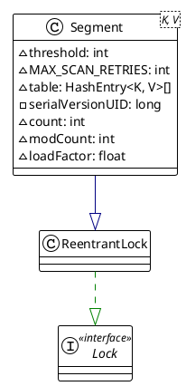

# 1.7

**主要利用 Unsafe 操作 + ReentrantLock+分段思想,

主要用到的 Unsafe 操作:
. compareAndSwapObject:通过cas的方式修改对象的属性
. putOrderedObject:并发安全的给数组的某个位置赋值
· getObjectVolatile :并发安全的获取数组某个位置的元素

ConcurrentHashMap采用分段锁技术将哈希表分成多个段(segment),每个段拥有一个可重入锁。这样可以在多个线程访问哈希表时，只需要锁住需要操作的那个段，而不是整个哈希表，从而提高了并发性能。
![[ConcurrentHashMap 1.7 构造方法.excalidraw|100%]]


> [!NOTE] ssize为什么要是2的次方数

## size

先后计算两次所有segment里面的数量大小和，两次结果相等，表明没有新的元素加入，计算的结果是正确的。如果不相等，就对每个segment加锁，再进行计算，返回结果并释放锁。

![[ConcurrentHashMap 1.7 size.excalidraw|100%]]
## 属性

```java
SSHIFT = 31 - Integer.numberOfLeadingZeros(ss);
```

Segment 是 ReentrantLock 的子类

![[ConkkcurrentHashMap 2024-02-27 14.08.21.excalidraw]]
## 构造函数

![[ConcurrentHashMap 2024-01-07 18.30.49.excalidraw|100%]]
## put插入

![[ConcurrentHashMap 2024-01-07 20.39.18.excalidraw|100%]]
## 扩容

![[ConcurrentHashMap 2024-01-07 22.41.52.excalidraw|100%]]
可以看出，1.7 的分段锁已经有了细化锁粒度的概念，它的一个缺陷是 Segment 数组一旦初始化了之后不会扩容，只有 HashEntry 数组会扩容，这就导致并发度过于死板，不能随着数据的增加而提高并发度。
# 1.8

主要利用 `Unsafe` 操作 + `synchronized` 关键字 + `分段思想`。
JDK1.8中，`ConcurrentHashap`的实现方式进行了改进，使用`CAS`+`synchronized`来保证线程安全。简单的写操作，会使用`CAS操作 + 自旋`来尝试修改，复杂的流程则对当前槽使用`synchronized`来同步修改。这样可以避免分段锁机制下的锁粒度太大，以及在高并发场景下，由于线程数量过多而导致的锁竞争问题，从而提高了并发性能。

总而言之，就是平日的操作会维护 map 里面的节点数量，会先通过 `CAS` 修改 `baseCount` ，如果成功就直接返回，如果失败说明此时有线程在竞争，那么就通过 hash 选择一个 `CounterCell` 对象就行修改，最终 size 的结果就是 `baseCount + 所有 CounterCell` 。

这种通过 `counterCell` 数组来减少并发下场景下对单个成员变量的竞争压力，提高了并发度，提升了性能，这也就是 `LongAdder` 的思想。

## size
先利用`sumCount()`计算，然后如果值超过int的最大值，就返回int的最大值。但是有时size就会超过最大值，这时最好用`mappingCount`方法

```java
public int size() {
	long n = sumCount();
	return ((n < 0L) ? 0 :
			(n > (long)Integer.MAX_VALUE) ? Integer.MAX_VALUE :
			(int)n);
}
```

```java
public long mappingCount() {
	long n = sumCount();
	return (n < 0L) ? 0L : n; // ignore transient negative values
}
```

sumCount 有两个重要的属性 `baseCount` 和 `counterCells` ，如果 `counterCells` 不为空，那么总共的大小就是baseCount与遍历 `counterCells` 的value值累加获得的。

```java
@jdk.internal.vm.annotation.Contended static final class CounterCell {
	volatile long value;
	CounterCell(long x) { value = x; }
}

final long sumCount() {
	CounterCell[] cs = counterCells;
	long sum = baseCount;
	if (cs != null) {
		for (CounterCell c : cs)
			if (c != null)
				sum += c.value;
	}
	return sum;
}
```

`baseCount` 是一个`volatile`变量，在`addCount`方法会使用它，而`addCount`方法在put结束后会调用更新计数。 在并发情况下，如果CAS修改baseCount失败后，就会使用到`CounterCell`类，利用CAS操作修改`CountCell`的值，如果上面CAS操作也失败了，在fullAddCount方法中，会继续死循环操作，直到成功。


## get
#面试 
1. 根据 key 计算出 hash 值;
2. 判断数组以及传入对象对应索引位置的桶是否为空;
	a. 为空，直接返回null
	b. 不为空，判断头节点是否是目标节点
		i. 是，则直接返回value
		ii. eh<0,说明是`ForwardingNode`节点或者是`TreeBin`红黑树头节点
			1. 如果是`ForwardingNode`，则会进入`nextTab`进行查找，查找方式同样是链表或红黑树查找方式进行遍历
			2. 如果是红黑树的结构，当红黑树正在调整时，使用的是较慢的方式：链表迭代进行查找节点，而不是等待树调整后再查找；如果再循环的过程中，红黑树已经调整完毕,则又会自动采用红黑树查找方式进行遍历
		iii.遍历链表匹配目标节点。
```java
public V get(Object key) {
	Node<K,V>[] tab; Node<K,V> e, p; int n, eh; K ek;
	// 计算哈希值
	int h = spread(key.hashCode());
	// 判断数组中传入对象对应索引位置的桶是否为空;
	if ((tab = table) != null && (n = tab.length) > 0 &&
		(e = tabAt(tab, (n - 1) & h)) != null) {
		// 	判断头节点是否是目标节点，是直接返回value
		if ((eh = e.hash) == h) {
			if ((ek = e.key) == key || (ek != null && key.equals(ek)))
				return e.val;
		}
		// eh<0,说明是ForwardingNode节点或者是TreeBin红黑树头节点
		// 如果是ForwardingNode,则会进入nextTab进行查找，查找方式同样是链表或红黑树查找方式进行遍历
		// 如果是红黑树的结构，当红黑树正在调整时，使用的是较慢的方式：链表迭代进行查找节点，而不是等待树调整后再查找；如果再循环的过程中，红黑树已经调整完毕,则又会自动采用红黑树查找方式进行遍历
		else if (eh < 0)
			return (p = e.find(h, key)) != null ? p.val : null;
		// 循环链表，寻找目标节点
		while ((e = e.next) != null) {
			if (e.hash == h &&
				((ek = e.key) == key || (ek != null && key.equals(ek))))
				return e.val;
		}
	}
	return null;
}

```

## put方法
#面试 
1. 判断数组是否为空，为空则进行数组初始化操作；
2. 判断数组索引所在节点f是否为空，为空则利用CAS+自旋操作将key和value添加到该数组节点:
3. fh == -1说明哈希表正在扩容，执行协助扩容操作。
4. 使用synchronized对头节点f进行加锁，执行串行化添加操作。
	1. 判断是否是链表，是再判断该链表中是否hash值和key值都相等的目标节点，存在则执行覆盖操作，不存在则采用尾插法插入到链表尾部;
	2. 不是链表，判断是否是红黑树，同样判断该红黑树中是否hash值和key值都相等的目标节点，存在则执行覆盖操作，不存在则插入新节点，重新调整红黑树使其平衡;
5. 判断链表个数是否大于等于8，是则进行树化操作; 
6. 节点数加1，流程执行结束。

```java
public V put(K key, V value) {
	return putVal(key, value, false);
}

/** Implementation for put and putIfAbsent */
final V putVal(K key, V value, boolean onlyIfAbsent) {
	if (key == null || value == null) throw new NullPointerException();
	// 获取hashcode
	int hash = spread(key.hashCode());
	int binCount = 0;
	// 通过自旋方式插入数据
	for (Node<K,V>[] tab = table;;) {
		Node<K,V> f; int n, i, fh; K fk; V fv;
		// 如果数组为空，则初始化
		if (tab == null || (n = tab.length) == 0)
			tab = initTable();
		// 算出数组下标，然后获取数组上对应下标的元素，如果为null，则通过cas赋值
		// 如果赋值成功，则退出自旋，否则是因为当前位置被其他线程赋值了，会返回失败
		// 然后进入下一次循环(就不会满足这个判断了)
		else if ((f = tabAt(tab, i = (n - 1) & hash)) == null) {
			if (casTabAt(tab, i, null, new Node<K,V>(hash, key, value)))
				break;                   // no lock when adding to empty bin
		}
		// 如果数组当前位置的元素hash值为MOVED，表示正在进行扩容，当前线程协助扩容
		else if ((fh = f.hash) == MOVED)
			tab = helpTransfer(tab, f);
		// 如果不存在才能put，当前节点为目前节点，直接返回原value
		else if (onlyIfAbsent // check first node without acquiring lock
				 && fh == hash
				 && ((fk = f.key) == key || (fk != null && key.equals(fk)))
				 && (fv = f.val) != null)
			return fv;
		else {
			V oldVal = null;
			// 对数组当前位置进行加锁
			synchronized (f) {
				// 加锁后检查tab[i]上的元素是否发生了变化，如果发生了变化则直接进入下一轮循环
				// 如果没有变化，则开始插入新的key，value
				if (tabAt(tab, i) == f) {
					// 如果tab[i]的hashcode大于等于0，说明是链表，就将元素插入到尾部
					if (fh >= 0) {
						// binCount代表当前链表上节点的个数，不包括新节点
						binCount = 1;
						// 遍历链表过程中比较hash值和key值是否相等，相等则完成覆盖操作
						for (Node<K,V> e = f;; ++binCount) {
							K ek;
							if (e.hash == hash &&
								((ek = e.key) == key ||
								 (ek != null && key.equals(ek)))) {
								oldVal = e.val;
								if (!onlyIfAbsent)
									e.val = value;
								break;
							}
							Node<K,V> pred = e;
							if ((e = e.next) == null) {
								pred.next = new Node<K,V>(hash, key, value);
								break;
							}
						}
					}
					// 该节点是红黑树节点，同样判断该红黑树中是否有hash值和key值都相等的目标节点。
					// 存在执行覆盖操作，不存在插入新节点，重新调整红黑树使其平衡。
					else if (f instanceof TreeBin) {
						Node<K,V> p;
						binCount = 2;
						if ((p = ((TreeBin<K,V>)f).putTreeVal(hash, key,
													   value)) != null) {
							oldVal = p.val;
							if (!onlyIfAbsent)
								p.val = value;
						}
					}
					else if (f instanceof ReservationNode)
						throw new IllegalStateException("Recursive update");
				}
			}
			if (binCount != 0) {
				// 判断链表是否大于等于8，是则进行树化；
				// 在插入新元素的时候，如果不算上新元素链表的个数已经大于等于8了， 那么就要树化，
				// 比如binCount为8，那么此时tab[i]的链表长度为9，因为包括了新元素
				if (binCount >= TREEIFY_THRESHOLD)
					treeifyBin(tab, i);
				// 存在key相同的元素
				if (oldVal != null)
					return oldVal;
				break;
			}
		}
	}
	addCount(1L, binCount);
	return null;
}

```

![[ConcurrentHashMap 1.8 put.excalidraw|100%]]

## initTable
1. sizeCtl <0，说明数组正在进行初始化或者扩容操作。让出当前CPU，重新加入到竞争队列。
2. 利用CAS修改sizeCtl = -1，表示正在初始化中,
	a. 双重判断数组是否为空;
	b. 初始化数组。默认16
	c. 设置sizeCtl = 数组长度 * 0.75

```java
/**
 * 初始化数组
 * put时发现数组是空的，则进行初始化
 */
private final Node<K,V>[] initTable() {
	Node<K,V>[] tab; int sc;
	while ((tab = table) == null || tab.length == 0) {
		// sizeCtl <0，说明数组正在进行初始化或者扩容操作。让出当前CPU，重新加入到竞争队列。
		if ((sc = sizeCtl) < 0)
			Thread.yield(); // lost initialization race; just spin
		// 利用CAS修改sizeCtl = -1，表示正在初始化中,
		// 如果改成功了则继续进行后续操作，如果没有成功，说明有其他线程在初始化或数组已经初始化好了
		else if (U.compareAndSetInt(this, SIZECTL, sc, -1)) {
			try {
				// 当前线程把sizeCtl改为-1后，再次判断数组是否为空
				if ((tab = table) == null || tab.length == 0) {
					// 如果初始化ConcurrentHashmap时指定了初始容量，那么sizeCtl为初始容量
					// 没有指定，取默认容量16
					int n = (sc > 0) ? sc : DEFAULT_CAPACITY;
					@SuppressWarnings("unchecked")
					Node<K,V>[] nt = (Node<K,V>[])new Node<?,?>[n];
					table = tab = nt;
					// 设置sc = 扩容阈值 n * 0.75
					sc = n - (n >>> 2);
				}
			} finally {
				// 将sc赋值给sizeCtl
				sizeCtl = sc;
			}
			break;
		}
	}
	return tab;
}

```
# 为什么ConcurrentHashMap不允许null值?
#面试 
· 主要是为了让ConcurrentHashMap的语义更加准确。
· 假如ConcurrentHashMap支持nul，那么get方法就会返回null值。那么就会存在一个不确定性，到底这个nul是put进去的还是没有找到该key而返回的nuIl呢?
· 在非并发环境下，这个问题可以通过contains方法来排除。但是，在并发环境下，contains方法执行过程中可能会被其他线程修改而导致结果不准确。
· 所以，为了不存在二义性，并发的Map框架一般都是不允许null的。


```java
// Node节点hash值，标识为指定的特殊节点，正常node节点hash值就是 key.hashCode() > 0
static final int MOVED     = -1; // ForwardingNode 节点hash标识
static final int TREEBIN   = -2; // TreeBin 红黑树头节点hash标识
static final int RESERVED  = -3; // ReservedNode 节点标识
static final int HASH_BITS = 0x7fffffff; // 正常节点hash散列的可用位数

/** 可用cpu核心数 */
static final int NCPU = Runtime.getRuntime().availableProcessors();
/**
 * 表初始化时的容量和触发扩容操作的阈值
 * 分为以下几种情况：
 * 0 ：数组未被初始化，初始容量为16
 * >0 ：如果数组未被初始化，那么记录数组的初始容量。如果数组已被初始化，那么记录的是数组的扩容阈值（数组的初始容量 * 0.75）
 * < -1 ：表示数组正在扩容，-(1+n)表示此时有n个线程正在共同完成数组的扩容操作。
 */
private transient volatile int sizeCtl;

```

- ForwardingNode：扩容时的转移标记节点，其hashcode=MOVED，代表着此时table正在做扩容操作。扩容期间，若table某个元素为 null，那么该元素设置为 ForwardingNode，当下个线程向这个元素插入数据，检查hashcode= MOVED，就会帮助扩容。

