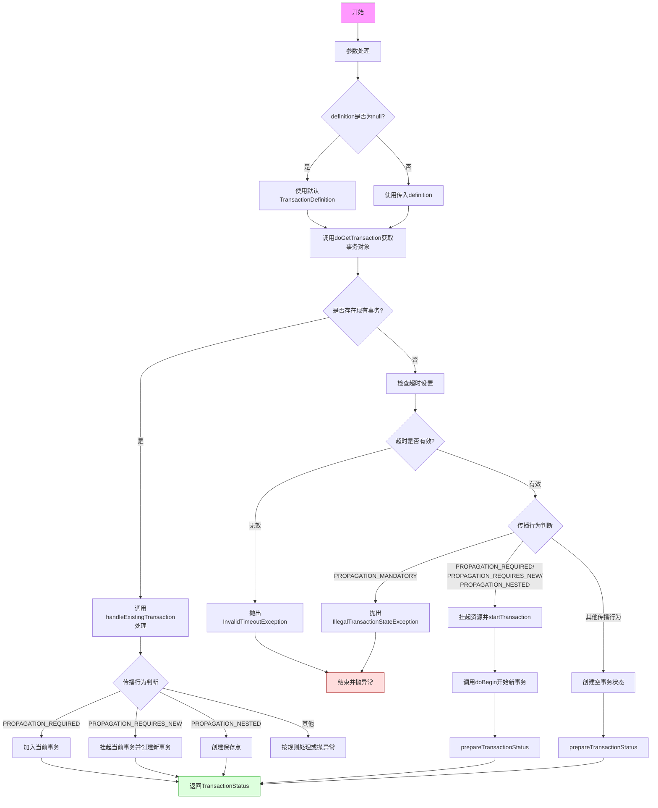

```mermaid
flowchart TD
    A[开始] --> B[参数处理]
    B --> C{definition是否为null?}
    C -->|是| D[使用默认TransactionDefinition]
    C -->|否| E[使用传入definition]
    D & E --> F[调用doGetTransaction获取事务对象]
    F --> G{是否存在现有事务?}
    
    G -->|是| H[调用handleExistingTransaction处理]
    H --> I{传播行为判断}
    I -->|PROPAGATION_REQUIRED| J[加入当前事务]
    I -->|PROPAGATION_REQUIRES_NEW| K[挂起当前事务并创建新事务]
    I -->|PROPAGATION_NESTED| L[创建保存点]
    I -->|其他| M[按规则处理或抛异常]
    
    G -->|否| N[检查超时设置]
    N --> O{超时是否有效?}
    O -->|无效| P[抛出InvalidTimeoutException]
    O -->|有效| Q{传播行为判断}
    
    Q -->|PROPAGATION_MANDATORY| R[抛出IllegalTransactionStateException]
    Q -->|PROPAGATION_REQUIRED/<br>PROPAGATION_REQUIRES_NEW/<br>PROPAGATION_NESTED| S[挂起资源并startTransaction]
    S --> T[调用doBegin开始新事务]
    T --> U[prepareTransactionStatus]
    
    Q -->|其他传播行为| V[创建空事务状态]
    V --> W[prepareTransactionStatus]
    
    U & W & J & K & L --> X[返回TransactionStatus]
    P & R --> Y[结束并抛异常]
    
    style A stroke:#333,fill:#f9f
    style X stroke:#090,fill:#dfd
    style Y stroke:#900,fill:#fdd
```
