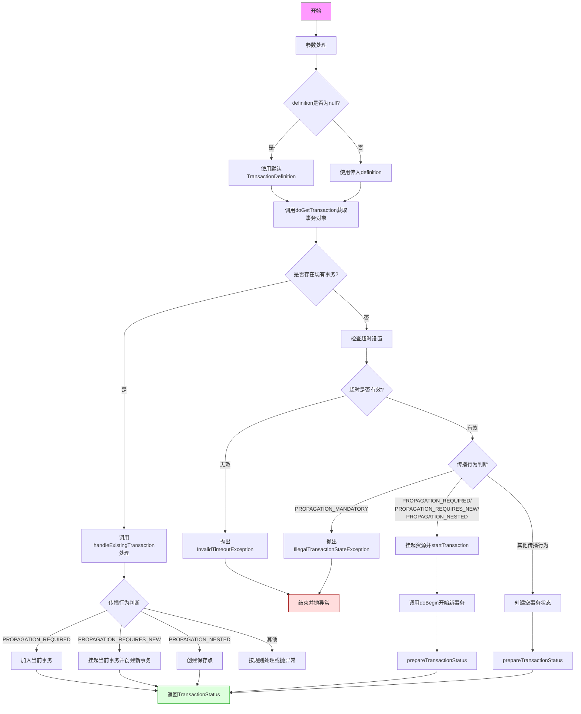

```plantuml
@startuml
start

group 参数初始化
  :参数处理;
  if (definition == null?) then (是) #lightblue
    :使用默认TransactionDefinition;
  else (否) #lightblue
    :使用传入的definition;
  endif
end group

:调用doGetTransaction()获取事务对象;

if (存在现有事务?) then (是) #palegreen
  group 处理现有事务
    :调用handleExistingTransaction();
    switch (传播行为)
      case (PROPAGATION_REQUIRED) #lightgreen
        :加入当前事务;
      case (PROPAGATION_REQUIRES_NEW) #lightgreen
        :挂起当前事务\n创建新事务;
      case (PROPAGATION_NESTED) #lightgreen
        :创建保存点;
      case (其他) #pink
        :按规则处理或抛异常;
    endswitch
  end group
else (否) #palegreen
  group 创建新事务
    :检查超时设置;
    if (超时无效?) then (是) #pink
      :抛出InvalidTimeoutException;
      stop
    else (否)
      switch (传播行为)
        case (PROPAGATION_MANDATORY) #pink
          :抛出IllegalTransactionStateException;
          stop
        case (PROPAGATION_REQUIRED/REQUIRES_NEW/NESTED) #lightblue
          :挂起资源;
          :调用startTransaction();
          :调用doBegin()开始新事务;
        case (其他) #lightgray
          :创建空事务状态;
      endswitch
    endif
    :prepareTransactionStatus();
  end group
endif

:返回TransactionStatus;
stop

@enduml
```
