# org.springframework.context.support.AbstractApplicationContext#refresh


```java
	public void refresh() throws BeansException, IllegalStateException {
		synchronized (this.startupShutdownMonitor) {
			StartupStep contextRefresh = this.applicationStartup.start("spring.context.refresh");

			// 准备刷新到上下文环境
			prepareRefresh();

			// 初始化beanFactory
			ConfigurableListableBeanFactory beanFactory = obtainFreshBeanFactory();

			// 对BeanFactory进行
			prepareBeanFactory(beanFactory);

			try {
				// 子类覆盖方法做额外处理
				postProcessBeanFactory(beanFactory);

				StartupStep beanPostProcess = this.applicationStartup.start("spring.context.beans.post-process");
				// 激活各种BeanFactory处理器
				invokeBeanFactoryPostProcessors(beanFactory);

				// 注册拦截Bean创建的Bean处理器,这里只是注册，真正的调用是在getBean时候
				registerBeanPostProcessors(beanFactory);
				beanPostProcess.end();

				// 为上下文初始化Message源，即不同语言的消息体，国际化处理
				initMessageSource();

				// 初始化应用消息广播器，并放入“applicationEventMulticaster”bean中
				initApplicationEventMulticaster();

				// 留给子类来初始化其它的Bean
				onRefresh();

				// 在所有注册的bean中查找Listener bean，注册到消息广播器中
				registerListeners();

				// 初始化剩下的单实例（非惰性的）
				finishBeanFactoryInitialization(beanFactory);

				// 完成刷新过程，通知生命周期处理器 lifecycleProcessor 刷新过程，同时发出ContextRefreshEvent通知别人
				finishRefresh();
			}

			catch (BeansException ex) {
				if (logger.isWarnEnabled()) {
					logger.warn("Exception encountered during context initialization - " +
							"cancelling refresh attempt: " + ex);
				}

				// Destroy already created singletons to avoid dangling resources.
				destroyBeans();

				// Reset 'active' flag.
				cancelRefresh(ex);

				// Propagate exception to caller.
				throw ex;
			}

			finally {
				// Reset common introspection caches in Spring's core, since we
				// might not ever need metadata for singleton beans anymore...
				resetCommonCaches();
				contextRefresh.end();
			}
		}
	}
```

```plantuml
@startuml  
skin rose
participant Actor  
Actor -> AbstractApplicationContext : refresh  
activate AbstractApplicationContext  
AbstractApplicationContext -> AbstractApplicationContext : prepareRefresh  
activate AbstractApplicationContext  
AbstractApplicationContext --> AbstractApplicationContext  
deactivate AbstractApplicationContext  
AbstractApplicationContext -> AbstractApplicationContext : obtainFreshBeanFactory  
activate AbstractApplicationContext  
AbstractApplicationContext --> AbstractApplicationContext  
deactivate AbstractApplicationContext  
AbstractApplicationContext -> AbstractApplicationContext : prepareBeanFactory  
activate AbstractApplicationContext  
AbstractApplicationContext --> AbstractApplicationContext  
deactivate AbstractApplicationContext  
AbstractApplicationContext -> AbstractApplicationContext : postProcessBeanFactory  
activate AbstractApplicationContext  
AbstractApplicationContext --> AbstractApplicationContext  
deactivate AbstractApplicationContext  
AbstractApplicationContext -> AbstractApplicationContext : invokeBeanFactoryPostProcessors  
activate AbstractApplicationContext  
AbstractApplicationContext --> AbstractApplicationContext  
deactivate AbstractApplicationContext  
AbstractApplicationContext -> AbstractApplicationContext : registerBeanPostProcessors  
activate AbstractApplicationContext  
AbstractApplicationContext --> AbstractApplicationContext  
deactivate AbstractApplicationContext  
AbstractApplicationContext -> AbstractApplicationContext : initMessageSource  
activate AbstractApplicationContext  
AbstractApplicationContext --> AbstractApplicationContext  
deactivate AbstractApplicationContext  
AbstractApplicationContext -> AbstractApplicationContext : initApplicationEventMulticaster  
activate AbstractApplicationContext  
AbstractApplicationContext --> AbstractApplicationContext  
deactivate AbstractApplicationContext  
AbstractApplicationContext -> AbstractApplicationContext : onRefresh  
activate AbstractApplicationContext  
AbstractApplicationContext --> AbstractApplicationContext  
deactivate AbstractApplicationContext  
AbstractApplicationContext -> AbstractApplicationContext : registerListeners  
activate AbstractApplicationContext  
AbstractApplicationContext --> AbstractApplicationContext  
deactivate AbstractApplicationContext  
AbstractApplicationContext -> AbstractApplicationContext : finishBeanFactoryInitialization  
activate AbstractApplicationContext  
AbstractApplicationContext --> AbstractApplicationContext  
deactivate AbstractApplicationContext  
AbstractApplicationContext -> AbstractApplicationContext : finishRefresh  
activate AbstractApplicationContext  
AbstractApplicationContext --> AbstractApplicationContext  
deactivate AbstractApplicationContext  
AbstractApplicationContext -> AbstractApplicationContext : destroyBeans  
activate AbstractApplicationContext  
AbstractApplicationContext --> AbstractApplicationContext  
deactivate AbstractApplicationContext  
AbstractApplicationContext -> AbstractApplicationContext : cancelRefresh  
activate AbstractApplicationContext  
AbstractApplicationContext --> AbstractApplicationContext  
deactivate AbstractApplicationContext  
AbstractApplicationContext -> AbstractApplicationContext : resetCommonCaches  
activate AbstractApplicationContext  
AbstractApplicationContext --> AbstractApplicationContext  
deactivate AbstractApplicationContext  
return  
@enduml
```



下面概括一下ClassPathXmlApplicationContext初始化的步骤，并从中解释一下它为我们提供的功能。

（1）初始化前的准备工作，例如对系统属性或者环境变量进行准备及验证。

在某种情况下项目的使用需要读取某些系统变量，而这个变量的设置很可能会影响着系统的正确性，那么ClassPathXmlApplicationContext为我们提供的这个准备函数就显得非常必要，它可以在Spring启动的时候提前对必须的变量进行存在性验证。

（2）初始化BeanFactory，并进行XML文件读取。

之前有提到ClassPathXmlApplicationContext包含着BeanFactory所提供的一切特征，那么在这一步骤中将会复用 BeanFactory 中的配置文件读取解析及其他功能，这一步之后，ClassPathXmlApplicationContext 实际上就已经包含了 BeanFactory 所提供的功能，也就是可以进行Bean的提取等基础操作了。

（3）对BeanFactory进行各种功能填充。

@Qualifier与@Autowired应该是大家非常熟悉的注解，那么这两个注解正是在这一步骤中增加的支持。

（4）子类覆盖方法做额外的处理。

（5）激活各种BeanFactory处理器。

（6）注册拦截bean创建的bean处理器，这里只是注册，真正的调用是在getBean时候。

（7）为上下文初始化Message源，即对不同语言的消息体进行国际化处理。

（8）初始化应用消息广播器，并放入“applicationEventMulticaster”bean中。

（9）留给子类来初始化其他的bean。

（10）在所有注册的bean中查找 listener bean，注册到消息广播器中。

（11）初始化剩下的单实例（非惰性的）。

（12）完成刷新过程，通知生命周期处理器lifecycleProcessor刷新过程，同时发出Context RefreshEvent通知别人。

## org.springframework.context.support.AbstractApplicationContext#prepareRefresh


