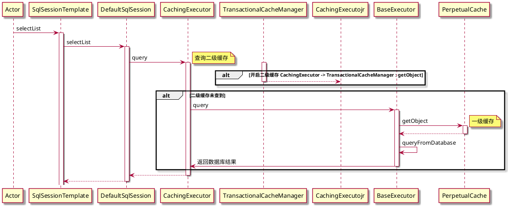

MyBatis 中的缓存机制有两种：一级缓存和二级缓存。当然，我们也可以通过集成第三方的缓存组件来自定义缓存。

# 一级缓存

一级缓存，也叫本地缓存，它是一种默认开启的 SqlSession 级别的缓存。在同一个 SqlSession 中，MyBatis 会将执行过的 SQL 查询语句的结果缓存到内存中，在接下来的业务代码中，如果再次执行完全相同的查询语句时，则会直接从内存中获取查询结果集而不在执行 SQL 语句。
一级缓存在 SQL 执行完就会被缓存，它本质上是一个 HashMap。

一级缓存在如下几种情形下会失效:
1. 不同的 SqlSession 会使一级缓存失效;
2. 同一个 SqlSession，但是查询语句不一样;
3. 同一个 SqlSession，查询语句一样，但是期间执行了增删改的操作;
4. 同一个 SqlSession，查询语句一样，但是期间执行了手动清除缓存的操作;

在多个 SqlSession 或者分布式环境下，当一个 SqlSession 查询完毕并缓存执行结果后，另外一个 SqlSession 更新了该数据，因为其他缓存了该查询结果的 SqlSession 是感知不到该更新操作的，所以此时就会产生脏数据。在 MyBatis内配置文件中，我们可以通过设置 localCacheScope 属性的值为 `STATEMENT` 来关闭一级缓存。

# 二级缓存

二级缓存是**基于 Mapper 配置文件命名空间**的缓存，它是一种可以在多个 SqlSession 间共享的缓存。二级缓存默认是不开启的，我们可以通过如下步骤开启二级缓存:
1. 在全局配置文件中开启二级缓存，即设置 cacheEnabled 属性的值为 true:
2. 在需要开启二级缓存的 Mapper 映射文件中使用 <cache />标签标注;
3. 相应的实体类要实现 Serializable 接口;

不同于一级缓存，二级缓存是在事务提交，即 SqlSession 关闭时才会被缓存。另外，虽说二级缓存本质上也是一个 Map，但是它的存储要比一级缓存更复杂，它的 Map 的 key 是 Mapper 配置文件的命名空间，value 是一个 Map。
二级缓存在如下情形下会失效:
1. 同一个命名空间进行了增删改的操作，会导致二级缓存失效。当然，我们也可以将增删改 SQL 标签的 flushCache 属性值设置为false 以保证二级缓存不会失效，但是这样会导致脏数据的产生，一般情况下我们也不会这么去设置。
2. 设置 select 标签的 useCache 属性值为 false，表示不使用缓存机制;
3. 如果希望 Mapper 映射文件的命名空间执行了增删改能够清空另外一个命名空间的缓存，我们可以使用<cache-ref/> 标签来设置:

正是因为二级缓存是基于 Mapper 配置文件命名空间的缓存，所以在多表联合查询的场景下，即使我们可以使用<cache-ref/>标签，毕竟它仅能配置一个命名空间，所以还是有很大可能会产生脏数据的!所以，一般情况下，请谨慎使用二级缓存。




## 禁用二级缓存
`@Options(useCache = false)`
```java
@Select("select * from ht")
@Options(useCache = false)
List<Map> select();

```
## 在debug代码时发现明明是一个接口生成代理类，为什么打印的是一个实现类。


- IDEA在debug程序时，当debug到某个对象时，会调用对象的toString()方法，用来在debug界面显示对象信息。
- IDEA调用toString()方法时，即使在toString()方法中设置了断点，该断点也不会被触发，也就是说，开发者多数情况下不会知道toString()方法被调用了
- 多数情况下调用一下toString()方法没有什么问题，但是也有例外，比如重写了toString()方法的类，随意的调用toString()方法会导致未知的问题。

可以看到我们代理类的 `toString()` 方法调用的时候，会自动获取目标对象`DefaultSqlSession`，所以debug的时候看到`DefaultSqlSession`


## 解决办法
我们把自动`toString()`关闭就好了 

再次运行发现正常了，`toString()`需要自己点击了

